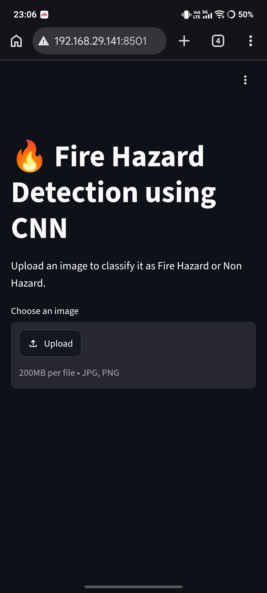
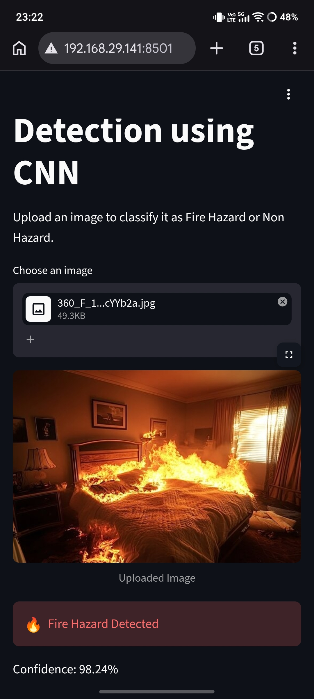
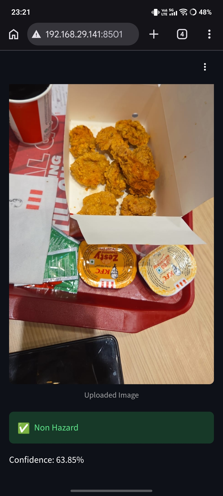

# 🔥 Fire Hazard Detection using CNN and SVM

## 📌 Project Overview

This project is an AI-powered image classification system that detects whether an uploaded image represents a **Fire Hazard** or **Non-Hazard**. It compares the performance of two machine learning approaches—**MobileNetV2 (CNN)** and **Support Vector Machine (SVM)**—to determine the most effective model for binary fire hazard classification.

A user-friendly **Streamlit web application** was also developed, allowing users to upload an image and receive an instant prediction.

---

## 🎯 Objectives

- Detect fire hazards from images using Artificial Intelligence.
- Compare Deep Learning and Machine Learning approaches.
- Build an interactive web application for image prediction.
- Evaluate models using multiple performance metrics.

---

## 📂 Dataset

**Source:** Kaggle / Roboflow Fire Detection Dataset

### Original Classes

- 🔥 Fire
- 💨 Smoke
- 💡 Light
- 🌳 Non-Fire

### Binary Classes Used

| Original Class | Converted Class |
|---------------|-----------------|
| Fire | Fire Hazard |
| Smoke | Fire Hazard |
| Light | Non Hazard |
| Non-Fire | Non Hazard |

### Dataset Statistics

| Split | Images |
|--------|--------:|
| Training | 13,883 |
| Validation | 1,712 |
| Testing | 1,749 |
| **Total** | **17,344** |

---

## 🛠 Technologies Used

- Python
- TensorFlow / Keras
- Scikit-learn
- Streamlit
- NumPy
- Pandas
- Pillow
- OpenCV
- Matplotlib

---

## 📊 Methodology

### Data Preprocessing

- Verified dataset integrity.
- Converted YOLO annotation files into binary labels.
- Mapped:
  - Fire + Smoke → Fire Hazard
  - Light + Non-Fire → Non Hazard
- Resized all images.
- Normalized pixel values.
- Used class weights to reduce the impact of dataset imbalance.

---

## 🤖 Models Implemented

### 1. MobileNetV2 (CNN)

- Transfer Learning
- Image Size: 224 × 224
- Binary Classification
- Sigmoid Activation
- Adam Optimizer
- Binary Cross-Entropy Loss

---

### 2. Support Vector Machine (SVM)

- Binary Classifier
- Images resized and converted into feature vectors
- Trained using Scikit-learn

---

## 📈 Results

| Model | Accuracy |
|--------|---------:|
| MobileNetV2 (CNN) | **91.94%** |
| Support Vector Machine (SVM) | **96.51%** |

### Observation

For this dataset, the SVM achieved higher classification accuracy than the CNN, demonstrating stronger performance for the prepared binary classification task.

---

## 🖥 Streamlit Web Application

Features:

- Upload JPG, JPEG, or PNG images.
- Real-time prediction.
- Displays uploaded image.
- Predicts:
  - 🔥 Fire Hazard
  - ✅ Non Hazard
- Shows prediction confidence.

---

## 📁 Project Structure

```
Fire-Hazard-Detection/
│
├── app.py
├── README.md
├── requirements.txt
├── Fire_Hazard_Detection.ipynb
├── fire_hazard_cnn.keras
├── fire_hazard_svm.pkl
├── sample_images/
├── screenshots/
└── models/
```
---

## 🚀 Installation

Clone the repository:

```bash
 git clone https://github.com/Sheshahh/Fire_Hazard_Detection.git 
```

Navigate to the project folder:

```bash
cd Fire-Hazard-Detection
```

Install dependencies:

```bash
pip install -r requirements.txt
```

Run the application:

```bash
streamlit run app.py
```

---

## 📷 Application Screenshots

### Home Page



### Fire Hazard Prediction



### Non Hazard Prediction



---

##  🔗 Live Demo

https://firehazarddetection.streamlit.app/

## 📌 Future Improvements

- Fine-tune MobileNetV2 by unfreezing deeper layers.
- Train the SVM using HOG (Histogram of Oriented Gradients) features.
- Expand the dataset with additional fire scenarios.
- Deploy the application using Streamlit Community Cloud.
- Add support for real-time webcam detection.

---

## 👩‍💻 Author

**Devi Shesha Malini**

Electronics and Communication Engineering

Passionate about Artificial Intelligence, Machine Learning, and Software Development.

---

## 📜 License

This project is intended for educational and research purposes.